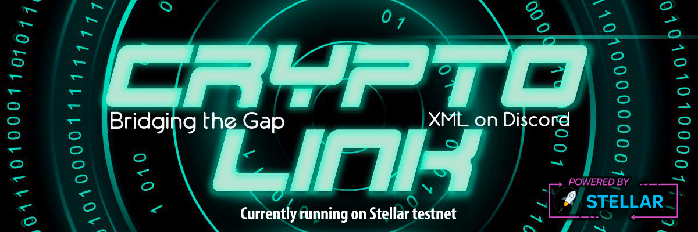

 


[](https://www.codacy.com/gh/launch-pad-investments/crypto-link/dashboard?utm_source=github.com&amp;utm_medium=referral&amp;utm_content=launch-pad-investments/crypto-link&amp;utm_campaign=Badge_Grade)
[](https://www.codefactor.io/repository/github/launch-pad-investments/crypto-link)
[](code_of_conduct.md)

# About Crypto Link
Crypto Link is a Discord multi functional bot. Built on top of Stellar, utilizing its native Stellar Lumen 
(XLM) crypto currency and tokens issued on Stellar chain, allows for execution of peer-to-peer crypto transactions, 
 token ICOs/project promotions, and Discord community monetization opportunities.

## License
Crypto Link is an open-source project operating under the [GNU GENERAL PUBLIC LICENSE](https://github.com/launch-pad-investments/crypto-link/blob/master/LICENSE).


## Project governance 
Project is governed by the Launch Pad Investments.

##  About Stellar Lumen  

Stellar is an open source, decentralized protocol for digital currency to fiat money transfers which allows 
cross-border transactions between any pair of currencies. The Stellar protocol is supported by a 501(c)3 nonprofit, 
the Stellar Development Foundation.

__More on Stellar, Foundation and its native cryptocurrency__:<br />
[Stellar](https://www.stellar.org/) <br />
[Stellar Foundation](https://www.stellar.org/foundation) <br />
[Stellar Lumnes](https://www.stellar.org/lumens) <br />

## Documentation
- [Quick Start as Discord User](USERCOMMANDS.md)
- [Contributing](CONTRIBUTING.md)
- 

## :hammer: Integration of Crypto Link to Discord :hammer: 
Monetizing guild community is instant and straight-forward. No programming skills required, just basic knowledge on how
Discord operate from user and owner perspective. 

### :warning: Required permissions for Crypto Link to operate optimally :warning:

* ***Manage Roles*** --> Required for Merchant System to operate optimally
* ***Manage Emojis*** --> Eventually custom emojis will be integrated
* ***Read, Send Messages*** --> Informing users on transactions and activities (not marketing!)
* ***Manage Messages*** --> Tx public reports are deleted after a while to keep channels clean
* ***Attach Files*** --> PDF reports on account statement and other infographics to be integrated
* ***Read Message History*** --> Required to read own  messages from the past for deletion 
* ***Add Reaction*** --> For use with special transactions 
* ***Mentions*** --> Transactions done by the role 
* ***Use of external emojis*** --> Custom emojis wil be integrated and cross community emojis

### After Crypto Link Joins 
Assign newly created role Crypto Link to the channels of your community where you would like that it operates and 
listens for commands, and everything will be set and ready to go.


### :crown: As Discord Guild Owner :crown:

#### :currency_exchange: Merchant System registration :currency_exchange:

In order to register corporate wallet and merchant system for community execute command:
```text
!merchant_initiate
```
once successfully registered you can check all available commands under:

#### :page_with_curl: Access merchant manual :page_with_curl:

Merchant manual can be access through
```text
!merchant manual
```

#### :moneybag: Check community balance :moneybag:
```text
!merchant balance
```

More on merchant system, its use cases, and set up procedure can be found [here](MERCHANTCOMMANDS.md).

Instructions to operate with corporate account can be found [here](CORPORATEACCOUNTMANAGEMENT.md)

## :money_with_wings: Fees for using the crypto link system :money_with_wings:
We have integrated as well operational fees to gather funding for further development. Fees are currently applied
 for following crypto link activities:

- [X] Merchant license fee 
- [X] Merchant wallet withdrawal
- [X] XLM withdrawal fee

Additional limits:
- [X] Minimum merchant transfer amount
- [X] Minimum stellar withdrawal amount 

For explanation on all the fees and limits read [here](FEESANDLIMITS.md) 
 
 To check current fees and their conversion please use command:

```text
!fees
```

## Bot management commands
Crypto Link has as well integrated command for management which are locked for Crypto Link Staff.
Commands are broken down into three specific areas:

- Bot basic administration commands
- Hot wallet queries
- Management of fees and limits for Crypto Link

More on commands and their showcase can be viewed [here](CRYPTOLINKSTAFF.md)

## Additional and Specific Material
- [Available Cryptocurrencies and fees on Crypto Link System](COINLIMITS.md)
- [Bot Set up functions only Crypto Link Staff](CLOFFCHAIN.md)
- [Help Commands](HELPCMDS.md)
- [Dealing with user accounts and making P2P payments](USERCOMMANDS.md)
- [Merchant System Only for Community owners](MERCHANTCOMMANDS.md)
- [Command map and help categories](COMMANDMAP.md)]


##Roadmap

[Development road-map](ROADMAP.md)

## Get in touch

### Crypto Link invite 
Coming soon (when its officially release)...

### Join us on Discord
[Discord Invite Link](https://discord.gg/ddvGTsb)

### Send us email
cryptolinkpayments@gmail.com

## Contributing 

By participating in contribution, you are expected to uphold this code. You can access Code of Conduct 
details [here](CODE_OF_CONDUCT.md). Please report unacceptable behavior to the project team 
at cryptolinkpayments@gmail.com. 

[Contributing guidlines](CONTRIBUTING.md)
[How to setup project](PROJECTSETUP.md)

### Contributors List
<a href="https://github.com/Launch-pad-investments/crypto-link/graphs/contributors">
  
</a>


## :pig2:  Support jar :pig2: 
### Cryptocurrencies
```text
BTC: 36vWbdegL57pHK3sVghrpwfp3V1tMqvHfc
ETH: 0x03AE3AD4b8d19091363Beb6f97AA10f8ae9c3284
XLM: GD6SRXH4BXMW7ANSW3PKXZNORKHRXQIGV7TYNK6DHSDB5ISC3M7FOQUU
NEO: AbXWN3yD7JpajRiPmXdaTF4KRCHjkVjUSV
ONT: AKSDsUfbyJcQgpycwi73MCvapseLwt2P1c
```

